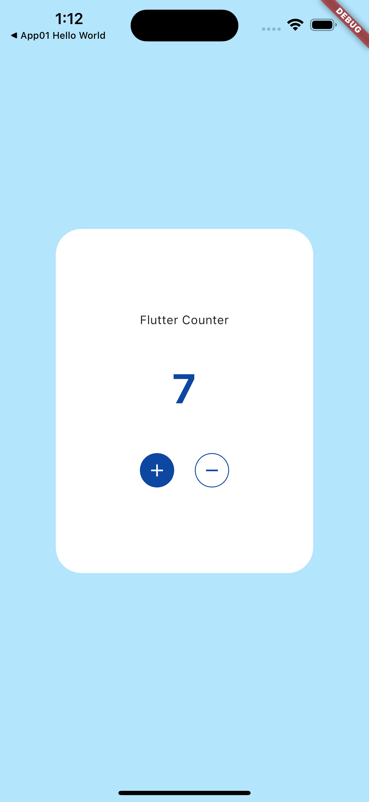

# app02_counter

[Reactアプリ100本ノック](https://qiita.com/Sicut_study/items/82059f9cbb5b2996e5b3) をflutterで実装しました。
flutterはプロジェクト作成段階でカウンターが実装されていますがこのアプリでは以下の変更点があります。
- UIをQiitaのものに似せる
- 状態管理をhooksで行う

# 完成品

